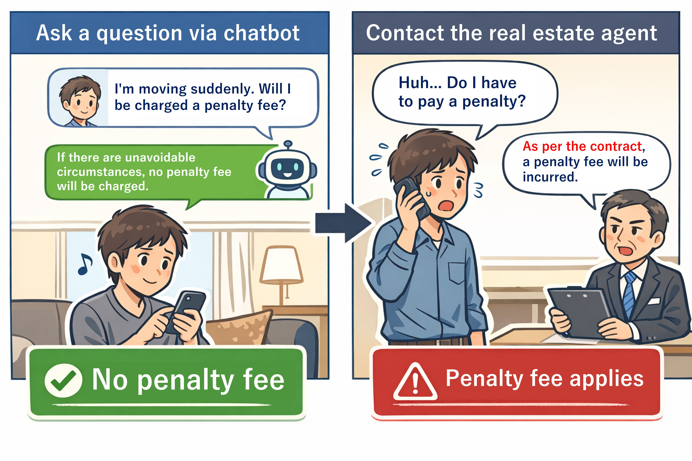
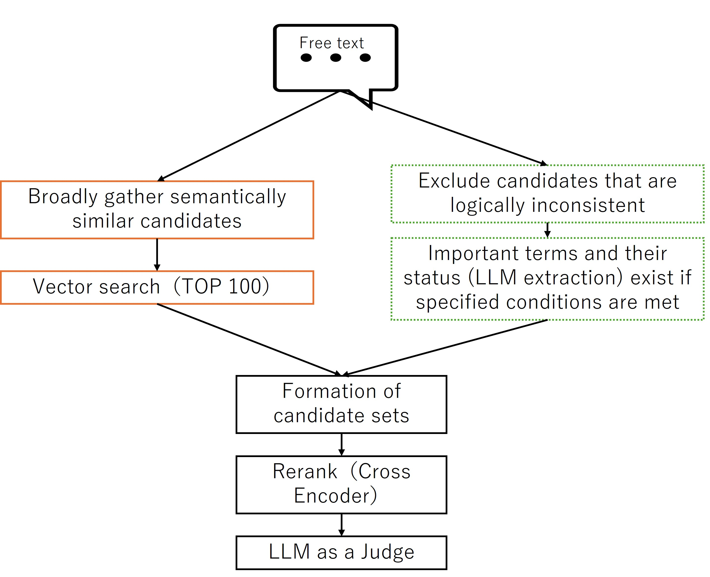
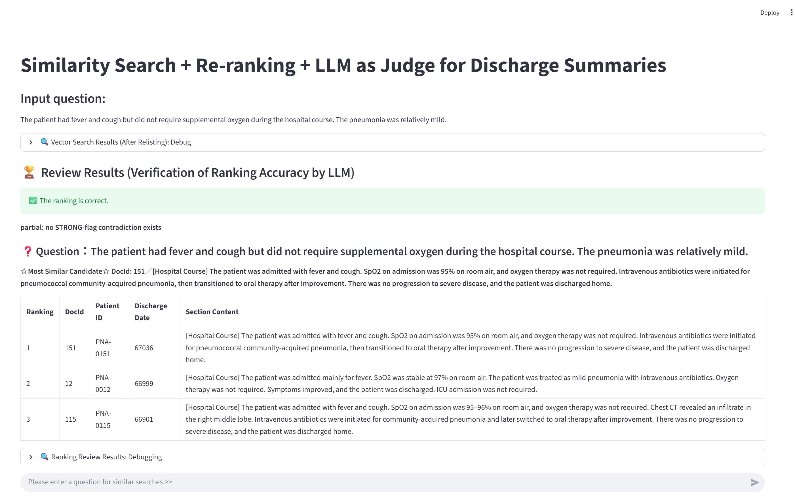

# Similar in Meaning, Opposite in Logic? — A Practical Workflow to Complement Vector Search with LLMs

Vector search is a retrieval method that converts text, images, audio, and other data into numeric vectors using an AI model, and then searches for items that are semantically close. It enables “semantic similarity search” from free text, which is difficult with keyword search alone.

However, in real use, I encountered cases where results that are “close in meaning” but **logically the opposite** appeared near the top of the search results.

This is a serious issue in situations where **affirmation vs. negation** matters. If the system returns the wrong answer, the impact can be significant, so we cannot ignore this problem.

This article does not propose a new algorithm.
I wrote it to share a practical way I found useful when semantic search fails due to negation.



In this article, I introduce a design that complements "logical differences" that vector search cannot handle well by combining **LLMs and SQL**.

Although the main walkthrough uses medical discharge summaries, the pattern itself is **domain-agnostic** and applies to any text domain where affirmation vs. negation matters.

> This article is not an implementation deep dive. The goal is to share a **design pattern**.

Contents:

- [Similar in Meaning, Opposite in Logic? — A Practical Workflow to Complement Vector Search with LLMs](#similar-in-meaning-opposite-in-logic--a-practical-workflow-to-complement-vector-search-with-llms)
  - [(1) Why vector search alone is not enough](#1-why-vector-search-alone-is-not-enough)
  - [(2) Negation is a limitation of embeddings](#2-negation-is-a-limitation-of-embeddings)
  - [(3) Use LLMs as preprocessing and postprocessing around search](#3-use-llms-as-preprocessing-and-postprocessing-around-search)
    - [Example (non-medical): IT incident / operations logs](#example-non-medical-it-incident--operations-logs)
    - [Preprocessing](#preprocessing)
    - [Postprocessing](#postprocessing)
    - [Overall workflow](#overall-workflow)
  - [(4) Separate semantic search and logical filtering](#4-separate-semantic-search-and-logical-filtering)
    - [TOP 100 (broad collection)](#top-100-broad-collection)
    - [TOP 50 + filter (logical exclusion)](#top-50--filter-logical-exclusion)
  - [(5) Prove correctness with reranking (Cross Encoder) and LLM-as-a-Judge](#5-prove-correctness-with-reranking-cross-encoder-and-llm-as-a-judge)
  - [(6) Keep search inside the DB with IRIS × Embedded Python](#6-keep-search-inside-the-db-with-iris--embedded-python)
  - [(7) Domains where this design fits / does not fit](#7-domains-where-this-design-fits--does-not-fit)
    - [Good fit](#good-fit)
    - [Not a good fit](#not-a-good-fit)
  - [(8) Summary](#8-summary)
  - [(9) How to run the sample](#9-how-to-run-the-sample)
    - [Embedded Python version](#embedded-python-version)
    - [SQLAlchemy version](#sqlalchemy-version)
    - [Sample Questions](#sample-questions)

---

## (1) Why vector search alone is not enough

First, here is an example of "semantically similar but logically opposite" results that I actually encountered.

This is from a test setup. The domain is **hospital discharge summaries**, specifically the “Hospital Course” section written by physicians at discharge. The goal is to find similar cases based on a free-text query. (For testing, I used 200 fictional records generated by an LLM.)

---

Query:

The patient had fever and cough but **did not require supplemental oxygen** during the hospital course. The pneumonia was relatively mild.

Below are the TOP 5 results.

In the line starting with `190 -`, the content includes the opposite meaning: **"Supplemental oxygen was provided briefly for desaturation."**

```text
12 - [Hospital Course] The patient was admitted mainly for fever. SpO2 was stable at 97% on room air. The patient was treated as mild pneumonia with intravenous antibiotics. Oxygen therapy was not required. Symptoms improved, and the patient was discharged. ICU admission was not required.
20 - [Hospital Course] The patient was admitted with fever and cough. SpO2 was 96% on room air, and oxygen therapy was not required. The patient was treated with intravenous antibiotics for localized pneumonia, showed improvement, and was discharged. ICU admission was not required.
203 - [Hospital Course] The patient was admitted with fever and fatigue. Respiratory symptoms were mild and there were no clear findings of pneumonia. The patient improved with intravenous fluids and observation. Supplemental oxygen and ICU management were not required, and the patient was discharged home.
190 - [Hospital Course] The patient was admitted with fever and cough. Pneumonia was suspected; however, imaging findings were nonspecific and the patient was managed as a respiratory infection with observation. Supplemental oxygen was provided briefly for desaturation. Antibiotics were used at the minimum necessary, and the patient improved and was discharged home.
151 - [Hospital Course] The patient was admitted with fever and cough. SpO2 on admission was 95% on room air, and oxygen therapy was not required. Intravenous antibiotics were initiated for pneumococcal community-acquired pneumonia, then transitioned to oral therapy after improvement. There was no progression to severe disease, and the patient was discharged home.
```

Because the "Supplemental oxygen was provided briefly for desaturation." record is followed by records that "oxygen therapy was not required", this ranking is not accurate as a result set.

This is not simply a data size problem. 
The context - "fever" and "cough" is shared, the **logical difference** of whether oxygen administration is required (affirmative/negative) is an example where it is difficult to fully reflect this distinction in vector similarity.

> If you want to confirm this **"logical difference"**, it may help [vectortest.py](./src/vectortest.py) in sample codes.
> You can run this in container:
> `python3 /src/vectortest.py`

So why do "logically opposite" items appear?

---

## (2) Negation is a limitation of embeddings

In this test, I used a general embedding model (OpenAI’s embedding model) to vectorize text.

There is research that points out this "logically opposite but retrieved" issue.

> Numerous prior studies have found that contextual text embedding models such as BERT, ELMO, RoBERTa or XLNet face challenges in accurately understanding negation.

According to an LLM summary of related work, there are reports that **affirmative and negated sentences can still be scored as highly similar.**

> Recent studies on Universal Text Embedding report that, for sentence pairs containing negation, **affirmative and negated sentences may be evaluated as highly similar.** The authors call this issue **Negation Blindness** and experimentally show that insufficient negation sensitivity harms the universality of embedding models.

Reference:
[Semantic Adapter for Universal Text Embeddings: Diagnosing and Mitigating Negation Blindness to Enhance Universality, arXiv:2504.00584](https://arxiv.org/abs/2504.00584)

There are also domain-specific embedding models. This article does not compare them, but at least with embedding-based retrieval alone, it is difficult to control negation/affirmation **strictly as a search condition**.

---

## (3) Use LLMs as preprocessing and postprocessing around search

If we can identify whether a key term is affirmed or negated in advance, then during vector search we can filter by that state and remove logically opposite results.

In this workflow, I use an LLM to extract important terms from both:

* the **query text**, and
* the **documents stored in the database**,

and determine whether each term is:

* **negated (0)**
* **affirmed (1)**
* **unknown (null)**

For terms I want to filter strongly, I store their values (0/1/null) as **dedicated columns** in the vector-search table and use them in SQL `WHERE` conditions.

For other terms, I store the extracted JSON as-is. After narrowing down to the top candidates (e.g., top 3), I use it as input to **LLM-as-a-Judge** to confirm whether the candidate truly matches (i.e., whether the key terms are consistent between query and candidate).

Important: I do not ask the LLM to "discover" key terms automatically. I **explicitly specify** which terms to extract in the prompt.

Only the **flag set** and the **vocabulary** change across domains.

The full extraction prompt is long because it includes domain-specific dictionaries and guardrails.
To keep the article readable, I show it in a collapsible block and provide only an abbreviated prompt for the non-medical example.

---
### Example (non-medical): IT incident / operations logs

Query (free text):

> The service experienced a temporary error, but the system was **not restarted**.
> A workaround was applied, and the incident was resolved without downtime.

A semantically similar but logically opposite log entry:

> The service experienced a temporary error and the system was **restarted** to recover.

This is a typical case where semantic similarity is high but the operational decision differs due to negation.

In this domain, we can extract a small set of operational flags, for example:

- `HasServiceRestarted` (1 / 0 / null)
- `HasWorkaroundApplied` (1 / 0 / null)
- `HasDowntime` (1 / 0 / null)

Abbreviated extraction prompt (example):

```text
Extract the following flags from the log text using ONLY explicit statements:
- HasServiceRestarted
- HasWorkaroundApplied
- HasDowntime

Rules:
- value = 1 only if explicitly stated
- value = 0 only if explicitly negated
- value = null if not explicitly mentioned
- No inference; negation does not propagate across flags
```
Example extracted JSON (minimal):

```json
{
    "HasServiceRestarted": {
        "value": 0,
        "evidence": "the system was not restarted",
        "confidence": 1.0
    }
}
```
---
<br>

In this workflow, the LLM appears both **before** and **after** vector search.

### Preprocessing

* Extract the key terms and their states from free text (query and documents). Output is fixed-format JSON.
* For database documents, decide which terms are strong filters and store their values (0/1/null) in table columns.

### Postprocessing

* For the top 3 results, run **LLM-as-a-Judge** to check whether the candidates truly match the query.
* The judge compares the extracted JSON from the query and from each candidate and confirms there is no semantic contradiction.

---

Terminology note (medical example only):

* **HFNC**: High-flow nasal cannula oxygen therapy
* **NPPV**: Non-invasive positive pressure ventilation using a mask

> Note: The extraction prompt above is intentionally detailed because negation handling is the core of this article.
> In other domains, the same structure applies; only the flag names and dictionary terms change.

<details>
<summary>Below is part of the prompt used in this test:</summary>

```python
SYSTEM_PROMPT = """You are an information extraction system that extracts structured clinical flags
ONLY based on what is explicitly stated in the input medical text.

Your task is to extract predefined flags from hospital course notes or query text.
Output MUST be a single JSON object and nothing else.
If something is not explicitly stated, set its value to null.

==================================================
CORE PRINCIPLES (NO INFERENCE — MOST IMPORTANT)
==================================================

- ZERO inference, guessing, or completion based on clinical knowledge.
- If something is NOT explicitly written in the text, value MUST be null.
- Do NOT infer from other flags.
  - Example: "No ICU admission" does NOT imply "no intubation".
  - Example: "Oxygen not required" does NOT imply "no HFNC / no NPPV / no intubation / no mechanical ventilation".
- Negation NEVER propagates across flags.
- Absence of mention ≠ negation.
  - "not mentioned", "no evidence", "unclear" → value = null (NOT 0).

==================================================
RULES FOR value = 1 / 0 / null
==================================================

- value = 1 (affirmed)
  - Only when the intervention/condition is explicitly stated as present.
- value = 0 (negated)
  - ONLY when the SAME flag is explicitly negated in the text.
  - Implicit negation or indirect reasoning is forbidden.
- value = null (unknown)
  - Use when the flag is not explicitly affirmed or explicitly negated.

==================================================
EVIDENCE RULES (STRICT)
==================================================

- When value is 1 or 0, you MUST include evidence.
- Evidence MUST be a direct quote (1–2 continuous sentences max) from the input text.
- Do NOT paraphrase, summarize, merge sentences, or use "...".
- If value = null: evidence MUST be null (never include supporting quotes for suspected/possible mentions).
  - polarity = "unknown"
  - evidence = null
  - confidence = 0.0 (default)
- Evidence MUST be a single minimal phrase whenever possible.
- Do NOT include multiple sentences unless absolutely unavoidable.
- Prefer the shortest exact span that directly supports the value.

==================================================
CONFIDENCE
==================================================

- confidence range: 0.0 – 1.0
- 1.0: direct, explicit statement
- <1.0: wording is indirect but still explicit
- Do NOT justify confidence using inference.

==================================================
NOTE FIELD
==================================================

- Use note ONLY when strictly necessary to explain ambiguity.
- Do NOT write reasoning, assumptions, or negative explanations like:
  - "not mentioned"
  - "probably"
  - "therefore"
- Keep note very short.

==================================================
SCOPE (MANDATORY)
==================================================

You MUST output scope for every flag:

- inpatient: occurred during hospitalization
- history: pre-existing or prior to admission
- discharge_plan: explicitly planned after discharge
- unknown: cannot be determined

Rules:
- Default scope is inpatient unless future wording is explicit.
- Use discharge_plan ONLY when future intent is clearly written
  (e.g., "will continue after discharge", "prescribed at discharge").

If value = null, scope MUST still follow the default scope rule:
set scope = "inpatient" unless the text explicitly indicates "history" or "discharge_plan";
do NOT set scope to "unknown" just because value is null.
For HasDiabetes: set scope="history" ONLY when diabetes is explicitly stated; if value=null and diabetes is not explicitly mentioned, set scope="unknown" (do NOT default to history).

==================================================
CRITICAL NEGATION SAFEGUARDS
==================================================

# Flag-specific negation only
- value=0 requires explicit negation of THAT EXACT FLAG.
- Negation does NOT propagate to other flags.

Examples:
- "oxygen therapy was not required"
  - HasOxygenTherapy = 0
  - HFNC / NPPV / Intubation / MV = null
- "ICU admission was not required"
  - HasICUCare = 0
  - Intubation / Vasopressor = null

==================================================
HANDLING "ROOM AIR"
==================================================

- "on room air" / "maintained on room air" MAY be used ONLY for:
  - HasOxygenTherapy = 0
    when it clearly describes the clinical course
    (e.g., "remained stable on room air throughout hospitalization")
- "room air" MUST NOT be used to negate:
  - HasHFNC
  - HasNPPV
  - HasIntubation
  - HasMechanicalVentilation
  - HasICUCare
  - HasVasopressor
- If those are not explicitly mentioned → value = null

==================================================
SYSTEMIC STEROIDS (VERY IMPORTANT)
==================================================

- HasSteroidSystemic refers ONLY to systemic steroids
  (oral or IV):
  - prednisolone / PSL
  - methylprednisolone
  - hydrocortisone
  - dexamethasone
- The following are NOT systemic steroids:
  - inhalation therapy
  - nebulizer therapy
  - inhaled bronchodilators
  - inhaled corticosteroids (ICS)

Rules:
- If ONLY inhalation therapy is mentioned:
  - HasSteroidSystemic = null
- Set HasSteroidSystemic = 0 ONLY with explicit statements like:
  - "no systemic steroids"
  - "systemic steroids were not used"
  - "steroids were not administered" (clearly systemic)

==================================================
SHOCK FLAG
==================================================

- HasShock = 1 ONLY if explicitly stated:
  - "shock"
  - "circulatory shock"
  - "shock state"
- Hypotension or elevated lactate ALONE is NOT sufficient.
- Absence of the word "shock" is NOT a reason for 0.
- Set HasShock = 0 ONLY with explicit denial:
  - "no shock"
  - "not in shock"
  - "shock was ruled out"

==================================================
AKI FLAG
==================================================

- HasAKI = 1 ONLY if explicitly stated:
  - "AKI"
  - "acute kidney injury"
- Renal dysfunction or nephrology consult alone → null
- Explicit denial required for value=0.

==================================================
SEPSIS FLAG (CLARIFIED)
==================================================

- HasSepsis = 1 ONLY when sepsis is explicitly stated as a diagnosis.
- If sepsis is described as "suspected", "suggested", "possible", or similar:
  - HasSepsis = null (NOT 1)
  - You may add a short note such as "suspected only".
- HasSepsis = 0 is allowed ONLY when the text explicitly states:
  "no sepsis", "sepsis was ruled out", "sepsis was excluded", or equivalent direct denial.
- Statements about pneumonia not being the primary cause, alternative diagnoses,
  or non-infectious etiologies MUST NOT be interpreted as sepsis negation.
  In such cases, set HasSepsis = null.


==================================================
DICTIONARY (EXPLICIT TERMS ONLY — NO INFERENCE)
==================================================

HasOxygenTherapy:
- 1: oxygen therapy, nasal cannula, mask, reservoir, O2 X L/min
- 0: oxygen not required, no oxygen therapy, managed on room air (course-level)

HasHFNC:
- 1: HFNC, high-flow nasal cannula, high-flow oxygen
- 0: no HFNC, HFNC not initiated

HasNPPV:
- 1: NPPV, CPAP, BiPAP, non-invasive ventilation
- 0: no NPPV, NPPV not initiated

HasIntubation:
- 1: intubation, endotracheal intubation
- 0: no intubation

HasMechanicalVentilation:
- 1: mechanical ventilation, ventilator management
- 0: no mechanical ventilation

HasTracheostomy:
- 1: tracheostomy
- 0: no tracheostomy

HasICUCare:
- 1: ICU admission, ICU care, ICU-level management
- 0: ICU admission not required, no ICU admission

HasSepsis:
- 1: sepsis
- 0: no sepsis (explicit only)

HasShock:
- see Shock rules above

HasVasopressor:
- 1: vasopressors, norepinephrine, dopamine, vasopressin
- 0: vasopressors not used

HasAKI:
- see AKI rules above

HasDialysis:
- 1: dialysis, CRRT, CHDF, HD, HDF
- 0: no dialysis

HasDiabetes:
- 1: diabetes mellitus, DM
- 0: no diabetes

HasInsulinUse:
- 1: insulin started, insulin therapy initiated
- 0: insulin not used, insulin discontinued

HasAntibioticsIV:
- value = 1 ONLY when intravenous administration is explicitly stated
  (e.g., "intravenous antibiotics", "IV antibiotics").
- Generic phrases such as "antibiotic treatment" or "improved with antibiotics"
  WITHOUT IV specification → value = null.

HasAntibioticsPO:
- value = 0 ONLY with explicit denial of oral antibiotics
  (e.g., "no oral antibiotics", "oral antibiotics were not used").
- Statements about treatment priority or primary management
  MUST NOT be interpreted as oral antibiotic negation.

==================================================
ANTIBIOTICS PO SCOPE RULE (CLARIFIED)
==================================================

- The phrase "switched to oral therapy" ALONE implies inpatient treatment.
- Set scope = "discharge_plan" ONLY when continuation after discharge is explicitly stated
  (e.g., "discharged on oral antibiotics", "continue oral antibiotics after discharge").

==================================================
OUTPUT CONSTRAINTS
==================================================

- Output ONLY a single JSON object.
- Do NOT output explanations or text outside JSON.
- All specified flags MUST be included.
- JSON must start with { and end with }.
"""
```
</details>
<br>
<details>
<summary>Example JSON extracted from free text:</summary>

Text:

```text
[Hospital Course] The patient was admitted with fever and cough. Pneumonia was suspected; however, imaging findings were nonspecific and the patient was managed as a respiratory infection with observation. Supplemental oxygen was provided briefly for desaturation. Antibiotics were used at the minimum necessary, and the patient improved and was discharged home.
```

Extracted JSON:

```json
{
    "HasOxygenTherapy": {
        "value": 1,
        "polarity": "affirmed",
        "evidence": "Supplemental oxygen was provided briefly for desaturation.",
        "confidence": 1.0,
        "scope": "inpatient",
        "note": ""
    },
    "HasHFNC": {
        "value": null,
        "polarity": "unknown",
        "evidence": null,
        "confidence": 0.0,
        "scope": "inpatient",
        "note": ""
    },
    "HasNPPV": {
        "value": null,
        "polarity": "unknown",
        "evidence": null,
        "confidence": 0.0,
        "scope": "inpatient",
        "note": ""
    },
    "HasIntubation": {
        "value": null,
        "polarity": "unknown",
        "evidence": null,
        "confidence": 0.0,
        "scope": "inpatient",
        "note": ""
    },
    "HasMechanicalVentilation": {
        "value": null,
        "polarity": "unknown",
        "evidence": null,
        "confidence": 0.0,
        "scope": "inpatient",
        "note": ""
    },
    "HasTracheostomy": {
        "value": null,
        "polarity": "unknown",
        "evidence": null,
        "confidence": 0.0,
        "scope": "inpatient",
        "note": ""
    },
    "HasICUCare": {
        "value": null,
        "polarity": "unknown",
        "evidence": null,
        "confidence": 0.0,
        "scope": "inpatient",
        "note": ""
    },
    "HasSepsis": {
        "value": null,
        "polarity": "unknown",
        "evidence": null,
        "confidence": 0.0,
        "scope": "inpatient",
        "note": ""
    },
    "HasShock": {
        "value": null,
        "polarity": "unknown",
        "evidence": null,
        "confidence": 0.0,
        "scope": "inpatient",
        "note": ""
    },
    "HasVasopressor": {
        "value": null,
        "polarity": "unknown",
        "evidence": null,
        "confidence": 0.0,
        "scope": "inpatient",
        "note": ""
    },
    "HasAKI": {
        "value": null,
        "polarity": "unknown",
        "evidence": null,
        "confidence": 0.0,
        "scope": "inpatient",
        "note": ""
    },
    "HasDialysis": {
        "value": null,
        "polarity": "unknown",
        "evidence": null,
        "confidence": 0.0,
        "scope": "inpatient",
        "note": ""
    },
    "HasDiabetes": {
        "value": null,
        "polarity": "unknown",
        "evidence": null,
        "confidence": 0.0,
        "scope": "unknown",
        "note": ""
    },
    "HasInsulinUse": {
        "value": null,
        "polarity": "unknown",
        "evidence": null,
        "confidence": 0.0,
        "scope": "inpatient",
        "note": ""
    },
    "HasAntibioticsIV": {
        "value": null,
        "polarity": "unknown",
        "evidence": null,
        "confidence": 0.0,
        "scope": "inpatient",
        "note": ""
    },
    "HasAntibioticsPO": {
        "value": null,
        "polarity": "unknown",
        "evidence": null,
        "confidence": 0.0,
        "scope": "inpatient",
        "note": ""
    },
    "HasSteroidSystemic": {
        "value": null,
        "polarity": "unknown",
        "evidence": null,
        "confidence": 0.0,
        "scope": "inpatient",
        "note": ""
    }
}
```

</details>

<br>

With preprocessing, if the query clearly contains a key term and we need to filter, we can filter (and exclude opposite-meaning documents).

With postprocessing, we can **prove** the remaining candidates are consistent by using the extracted key terms and their states.

---

### Overall workflow

Extract negation/affirmation/unknown (0/1/null) for key terms from the query text

  ↓

Vector search using the query (TOP 100)

  ↓

If filtering is possible: filter + vector search again (TOP 50)

  ↓

Merge the two result sets and re-check for "negated in query but affirmed in result" contradictions (code-based check)

  ↓

Rerank the top 50 (Cross Encoder)

  ↓

Final validation of top 3 by LLM-as-a-Judge

This workflow generalizes across domains: only the flag set and vocabulary change, while filtering, reranking, and judge-based validation stay the same.

You may wonder: "Why run vector search twice? Why not filter from the beginning?"
The next section explains the reason.

---

## (4) Separate semantic search and logical filtering

Once we can filter by negation/affirmation, it seems we could do a single filtered vector search. But in this workflow, I intentionally do **not**.

Reason: filtering too early can remove too much information and cause **missed relevant cases**. To reduce misses, I separate:

* **TOP 100**: collect broadly (high recall)
* **TOP 50 + filter**: remove logically opposite cases (precision)

Then I merge them.

### TOP 100 (broad collection)

* Collect anything that seems semantically close.
* Some odd candidates may be included.

### TOP 50 + filter (logical exclusion)

* Explicitly exclude logically opposite candidates.
* Remove “close in meaning but different conditions” cases.

For example, if oxygen therapy is clearly affirmed, I use:

```sql
SELECT TOP :topN
  c.DocId, c.SectionText, c.FlagsJson,
  VECTOR_COSINE(c.Embedding, TO_VECTOR(:query_vec, FLOAT, 1536)) AS score_text,
  d.PatientId, d.DischargeDate
FROM Demo.DischargeSummaryChunk c, Demo.DischargeSummaryDoc d
WHERE d.DocId=c.DocId AND (c.SectionType = 'hospital_course')
  AND (c.HasOxygenTherapy = 1)
ORDER BY score_text DESC
```

If oxygen therapy is **not clearly affirmed** (unknown or negated), I use:

```sql
SELECT TOP :topN
  c.DocId, c.SectionText, c.FlagsJson,
  VECTOR_COSINE(c.Embedding, TO_VECTOR(:query_vec, FLOAT, 1536)) AS score_text,
  d.PatientId, d.DischargeDate
FROM Demo.DischargeSummaryChunk c, Demo.DischargeSummaryDoc d
WHERE d.DocId=c.DocId AND (c.SectionType = 'hospital_course')
  AND (c.HasOxygenTherapy IS NULL OR c.HasOxygenTherapy = 0)
ORDER BY score_text DESC
```



> In the diagram, “Key terms and their states” refers to information extracted and saved in advance by the LLM for both the query and documents.

After merging the two result sets, I run code that checks the extracted states again and confirms there is no “must-not-include contradiction,” such as: **query strongly negates oxygen, but a result strongly affirms oxygen.**

Here, I exclude only contradictions that I **never want**. Minor mismatches and unknowns (null) are left to reranking and judge steps.

<details>
<summary>Code used for the “hard exclusion” check (after merging): <a href="./src/UI_embedded_python/search.py">search.py</a></summary>

```python
#-----------------------------------
# Using two sets of similar search results and the query text
# Check for discrepancies in negation (0) for specific terms within the query text
# (Exclude absolute contradictions: those not removable via WHERE clauses, and post-merge inclusions)
# If the query strongly negates (0) but the DB affirms (1), remove from results
# (Utilizes the confidence value from the LLM's response: Can specify via parameter which threshold triggers removal)
# If the DB shows value==1 but low confidence, it may be a false positive and is not excluded
#-----------------------------------
def hard_exclude_contradictions(
    results,
    query_text,
    query_flags,
    hard_flags=None,
    conf_th=0.9,         # query
    doc_conf_th=0.8,     # doc
    bypass_accept_if_query_conf_ge=0.99,
):
    q = normalize_flags_dict(query_flags)
    hard_flags = hard_flags or ["HasOxygenTherapy"]

    out = results
    for flag_name in hard_flags:
        fq = q.get(flag_name, {})
        if not (isinstance(fq, dict) and fq.get("value", None) == 0):
            continue

        q_conf = float(fq.get("confidence", 0.0) or 0.0)
        if q_conf < conf_th:
            continue

        #  For ultra-high reliability, _should_accept_negation_ is not required.
        if q_conf < bypass_accept_if_query_conf_ge:
            if not _should_accept_negation(flag_name, fq, query_text):
                continue

        kept = []
        for r in out:
            d = normalize_flags_dict(r.get("FlagsJson"))
            dv = _get_value(d, flag_name)

            d_obj = d.get(flag_name, {})
            d_conf = 0.0
            if isinstance(d_obj, dict):
                try:
                    d_conf = float(d_obj.get("confidence", 0.0) or 0.0)
                except (TypeError, ValueError):
                    d_conf = 0.0

            # Drop only the likely “1”
            if dv == 1 and d_conf >= doc_conf_th:
                continue

            kept.append(r)

        out = kept

    return out
```

</details>

---

## (5) Prove correctness with reranking (Cross Encoder) and LLM-as-a-Judge

From the merged results, I rerank the top 50. Many models can be used; in the sample, I use **`BAAI/bge-reranker-v2-m3`**.

A Cross Encoder is not specifically designed to “understand negation logically” as a rule engine. Instead, it **scores query–candidate pairs more precisely for semantic similarity**, and rebuilds the ranking.

Then, using the top 3 after reranking plus the extracted JSON of key-term states, I run **LLM-as-a-Judge** to validate whether the extracted information truly matches.

This is not just comparing rerank scores. Because the judge checks consistency of key terms and their states, it also supports explainability: we can describe **why** a candidate is accepted or rejected.

The JSON passed to LLM-as-a-Judge includes:

* extracted key-term states for the query,
* extracted key-term states for the top 3 candidates, and
* ranking scores.

<details>
<summary>Example JSON passed to the judge (see code for prompt details): <a href="./src/UI_embedded_python/app.py">app.py</a></summary>

```python
SYSTEM_PROMPT = """
You are a Judge that evaluates the validity of ranking candidates (top3).

You MUST evaluate candidates using ONLY:
- query_flags.<FlagName>.value
- ranked_top3[i].FlagsJson.<FlagName>.value

You MUST NOT read, interpret, infer, or use:
- query_text
- SectionText
- evidence
- any clinical or medical knowledge

This is a STRICT, MECHANICAL rule-execution task.

==================================================
VALUE DEFINITIONS
==================================================

Each flag value is exactly one of:
- 1    : explicitly present
- 0    : explicitly absent
- null : unknown / not stated

CRITICAL:
- null is NOT a negation
- null is NEVER a contradiction
- You MUST NEVER treat null as 0

==================================================
FLAG CATEGORIES
==================================================

STRONG FLAGS (the ONLY flags that can affect verdict/decision):
- HasICUCare
- HasNPPV
- HasMechanicalVentilation
- HasIntubation
- HasDialysis
- HasVasopressor

WEAK FLAGS (EXPLANATION ONLY; MUST NOT affect verdict/decision):
- HasOxygenTherapy
- HasAntibioticsIV
- HasAntibioticsPO
- HasSteroidSystemic
- HasHFNC
- HasSepsis
- HasShock
- HasAKI
- HasDiabetes
- HasInsulinUse

==================================================
STATUS DETERMINATION (MECHANICAL)
==================================================

For EACH flag, determine status using ONLY the following rules:

1) If query value is null -> status = neutral
2) Else if document value is null -> status = neutral
3) Else if query value == document value -> status = match
4) Else if flag is STRONG AND query=1 AND document=0 -> status = contradict
5) Else -> status = neutral

RULE:
- WEAK flags MUST NEVER output "contradict" (even if values differ)

==================================================
MISMATCH — THE ONLY ALLOWED CONDITION
==================================================

A candidate is "mismatch" IF AND ONLY IF:
- At least ONE STRONG flag has status = contradict
(i.e., STRONG AND query=1 AND doc=0)

IMPORTANT:
- doc=null is NEVER mismatch
- No other condition may cause mismatch

==================================================
VERDICT DETERMINATION (PER CANDIDATE)
==================================================

Use ONLY STRONG flags for verdict.

Let STRONG_EXPLICIT = the set of STRONG flags where query value is 0 or 1.

- mismatch:
    If at least one STRONG flag has status = contradict

- match:
    If NO STRONG contradict exists
    AND STRONG_EXPLICIT is NOT empty
    AND at least ONE flag in STRONG_EXPLICIT has status = match

- partial:
    Otherwise (includes cases where STRONG_EXPLICIT is empty)

NOTE:
- WEAK flags MUST NOT move a candidate from partial->match
- WEAK flags MUST NOT move a candidate to mismatch

==================================================
DECISION (TOP-1 ONLY, NO EXCEPTIONS)
==================================================

- decision.top_doc_id MUST equal ranking[0].doc_id
- decision.is_similar_enough is determined ONLY by ranking[0].verdict:
    - match    -> true
    - mismatch -> false
    - partial  -> true or false allowed

- ranking[1] and ranking[2] MUST NOT affect decision

==================================================
SUMMARY CONSTRAINT
==================================================

decision.summary MUST be EXACTLY one of:
- "match: no STRONG-flag contradiction exists"
- "partial: no STRONG-flag contradiction exists"
- "mismatch: STRONG-flag contradiction detected"

NO additional text.

==================================================
OUTPUT FORMAT
==================================================

Output MUST be valid JSON ONLY.

ranking MUST:
- contain exactly 3 items
- be ordered by rank = 1, 2, 3
- have strictly decreasing relevance scores

reasons:
- up to 5 short strings
- MUST be derived ONLY from (flag name, query value, doc value, status)
- Do NOT mention any text fields.

If ANY rule is violated, you MUST correct the output BEFORE responding.
"""

JUDGE_SCHEMA: Dict[str, Any] = {
    "type": "object",
    "additionalProperties": False,
    "required": ["decision", "ranking"],
    "properties": {
        "decision": {
            "type": "object",
            "additionalProperties": False,
            "required": ["top_doc_id","is_similar_enough", "confidence", "summary", "missing_info"],
            "properties": {
                "top_doc_id": {"type": "number"},
                "is_similar_enough": {"type": "boolean"},
                "confidence": {"type": "number", "minimum": 0.0, "maximum": 1.0},
                "summary": {"type": "string"},
                "missing_info": {"type": "array", "items": {"type": "string"}},
            },
        },
        "ranking": {
            "type": "array",
            "minItems": 3,
            "maxItems": 3,
            "items": {
                "type": "object",
                "additionalProperties": False,
                "required": ["doc_id", "rank", "relevance", "verdict", "reasons"],
                "properties": {
                    "doc_id": {"type": "number"},
                    "rank": {"type": "number"},
                    "relevance": {"type": "number", "minimum": 0.0, "maximum": 1.0},
                    "verdict": {"type": "string", "enum": ["match", "partial", "mismatch"]},
                    "reasons": {"type": "array", "items": {"type": "string"}, "maxItems": 5},
                },
            },
        },
    },
}

def build_user_prompt(item: dict) -> str:
    return f"""Judge the following input JSON.

Input:
<<<
{json.dumps(item, ensure_ascii=False)}
>>>

FINAL CHECK (MANDATORY):
- Use ONLY query_flags.<flag>.value and ranked_top3[i].FlagsJson.<flag>.value
- doc=null is NEVER mismatch
- WEAK flags NEVER output "contradict" and NEVER affect verdict/decision
- mismatch requires STRONG AND query=1 AND doc=0
- decision depends ONLY on rank1
- summary MUST be exactly one of the 3 allowed strings
- Output JSON ONLY
"""
```

</details>

In high-stakes domains such as medical, legal, or business search, we need explicit evidence for decisions. This workflow can be one practical approach.

---

## (6) Keep search inside the DB with IRIS × Embedded Python

In this workflow, vector search runs **twice**.

Also, we retrieve not only free text, but also the extracted JSON of key-term states for both query and results. This can involve a large volume of data.

In many systems, search pipelines try to reduce the number of large data transfers.

One approach in InterSystems IRIS is **Embedded Python**.

> 📖 For details about Embedded Python, see:
> - [[Video] What is Embedded Python](https://community.intersystems.com/node/512786)
> - [[Community article] Embedded Python tag](https://community.intersystems.com/tags/embedded-python)
> - [[Document]Introduction to Embedded Python](https://docs.intersystems.com/irislatest/csp/docbook/DocBook.UI.Page.cls?KEY=AFL_epython)

You can run SQL via SQLAlchemy, but with Embedded Python you can execute the two vector searches on the server side and run business logic without transferring large datasets back and forth.

---

## (7) Domains where this design fits / does not fit

### Good fit

* **IT operations / incident response (logs, incident records)**
  
  Example: "An error occurred, but the system was **not restarted**; a temporary workaround was applied."
  
  Whether an action was done or not done (restarted vs. not restarted, workaround applied vs. not applied) often changes the correct response.
  In this domain, typical flags look like:
  `HasServiceRestarted`, `HasWorkaroundApplied`, `HasDowntime` (1 / 0 / null).

* **Contracts / legal / compliance (clauses, prior decisions)**

  Example: "Early termination is allowed, and **no penalty** applies in this case."
  Again, "applies / does not apply" can be critical.

  Example flags: `HasEarlyTermination`, `HasPenaltyFee` (1 / 0 / null).

* **Medical search (similar discharge summaries)**

  Example: "Admitted with high fever and cough and **received short-term oxygen therapy due to low SpO2** …"

  When you must avoid mixing affirmed and negated conditions, explicit negation handling becomes important.

### Not a good fit

* **Reviews / social media posts**

  Example: "The movie was interesting / boring," "The staff was unfriendly."

  These are strongly subjective; defining "key terms and their states" often does not improve retrieval much.

* **Multimodal-first search (images, audio, video)**

  This design assumes logical structures like negation/affirmation in text. For image- or audio-centered search, explicit structuring is much harder.

* **Casual exploratory search**

  If the goal is "browse related topics broadly," diversity matters more than strict logical consistency. This design can be excessive.

---

## (8) Summary

This design complements a limitation of embeddings (negation/affirmation) by separating responsibilities:

* **semantic retrieval** (vector search, reranking)
* **logical control / validation** (LLM-extracted states, SQL filtering, judge)

If you can define key terms, this pattern can be applied not only to medical text but also to other domains where negation and affirmation are important.

This is not a novel technique, but a combination of existing ideas.
I hope this concrete example helps others who struggle with negation in vector search.

---

## (9) How to run the sample

There are two implementations:

* Embedded Python version
* SQLAlchemy version

Both use OpenAI, so set your API key in [`.env`](/.env) before starting the container:

```text
OPENAI_API_KEY=sk-x*****
```

Start containers:

```bash
docker compose up -d
```

Login to the container:

```bash
docker exec -it negation_aware_search_en bash
```

### Embedded Python version

Source code is under: [`/src/UI_embedded_python/`](/src/UI_embedded_python/)

Run with `irispython`:

```bash
/usr/irissys/bin/irispython /home/irisowner/.local/bin/streamlit run /src/UI_embedded_python/app.py --server.port 8080 --logger.level=debug
```

Open UI: `http://localhost:8081`  (mapped from container port 8080)

### SQLAlchemy version

Source code is under: [`/src/UI_sqlalchemy/`](/src/UI_sqlalchemy/)

Run:

```bash
/home/irisowner/.local/bin/streamlit run /src/UI_sqlalchemy/app.py --server.port 8090 --logger.level=debug
```

Open UI: `http://localhost:8091`  (mapped from container port 8090)



### Sample Questions

- The patient had fever and cough but did not require supplemental oxygen during the hospital course. The pneumonia was relatively mild.
- The patient was admitted for community-acquired pneumonia but remained on room air throughout hospitalization; supplemental oxygen was not required.
- The patient was admitted for pneumonia; respiratory status was stable and no oxygen therapy was administered.
- The patient was admitted with dyspnea and received supplemental oxygen, but ICU-level care was not necessary.
- Hypoxemia was noted on admission and was managed with nasal cannula oxygen; the patient was managed on the general ward.
- Supplemental oxygen was provided, but the patient did not deteriorate and did not require ICU admission.
- The patient was admitted with severe pneumonia and required ICU-level care due to worsening respiratory status.
- The patient developed respiratory failure after admission and required management in the intensive care unit.
- Community-acquired pneumonia progressed to severe disease, requiring comprehensive ICU management.
- During treatment for pneumonia, glycemic control for diabetes mellitus became necessary and insulin therapy was administered.
- With a history of diabetes mellitus, glycemic management was implemented in parallel with treatment of the infection.
- In this patient with diabetes mellitus, inpatient management included initiation of insulin therapy.
- Antibiotics were started intravenously and, after clinical improvement, transitioned to oral therapy.
- The patient was treated with intravenous antibiotics during hospitalization and was subsequently switched to oral agents.
- Intravenous antibiotics were initiated, and the patient was transitioned to oral antibiotics before discharge.
- Symptoms improved with treatment, and the patient was discharged home in stable condition.
- Inflammatory markers improved, and the patient was discharged home without issues.
- After confirming clinical improvement, the patient was discharged home.
- The patient was admitted with dyspnea and received supplemental oxygen for desaturation. Chest X-ray showed congestion, and the condition improved with diuretics. Antibiotic therapy for pneumonia was not the main focus.
- The patient was brought in by ambulance with orthopnea; hypoxemia persisted despite oxygen therapy, so NPPV was initiated. Respiratory status improved with intravenous diuretics, and acute heart failure exacerbation—not infection—was the primary cause.
- The patient was admitted with cough and dyspnea and received supplemental oxygen. The condition improved with bronchodilators and steroids; imaging showed no clear pneumonia, and COPD exacerbation was the predominant issue.
- The patient was admitted with worsening respiratory status and started on supplemental oxygen for desaturation. NPPV was initiated for hypercapnia, and treatment targeted COPD exacerbation more than antibiotic therapy.
- The patient was admitted with high fever and cough and received short-term oxygen for desaturation. A rapid test was positive for influenza, and the patient improved primarily with supportive care rather than antibiotics.
- The patient was admitted with cough, sputum, and fever, but chest imaging did not clearly show pneumonia. The patient improved with symptomatic treatment; supplemental oxygen and ICU care were not required.
- The patient was admitted with worsening exertional dyspnea and received supplemental oxygen for desaturation. There were few signs of infection; treatment was centered on steroids (antibiotics were adjunctive).
- After choking, the patient developed fever and cough and was admitted. Intravenous antibiotics were started for aspiration pneumonia, and swallowing evaluation with diet modification was performed. Antibiotics were later transitioned to oral therapy after improvement.
- The patient was admitted with high fever and elevated inflammatory markers and started on intravenous antibiotics. Respiratory symptoms were mild with little evidence of pneumonia; pyelonephritis was the primary cause. After improvement, antibiotics were switched to oral therapy and the patient was discharged.
- The patient was admitted with high fever and altered mental status, and intravenous antibiotics and fluids were initiated. Supplemental oxygen was given for desaturation, but the suspected source was outside the lungs; the patient was treated for sepsis.
